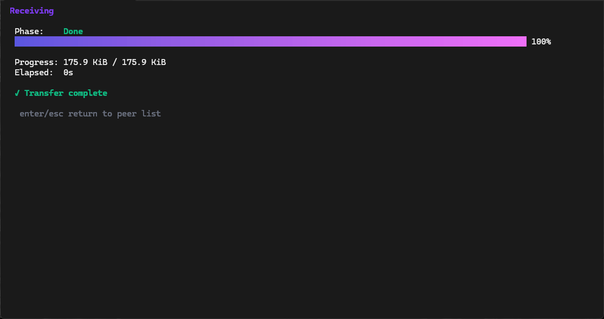
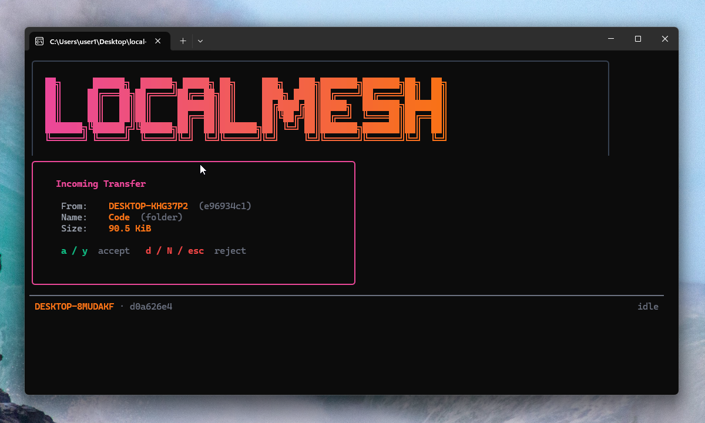
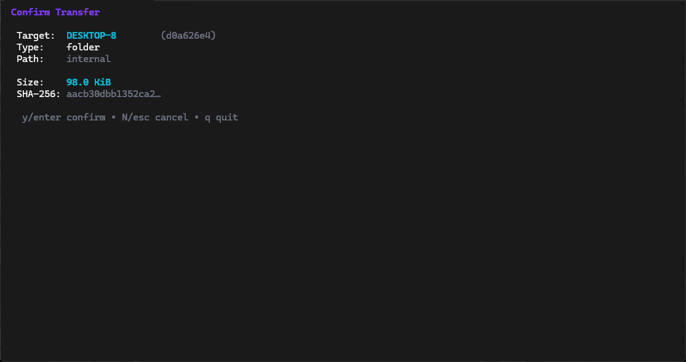
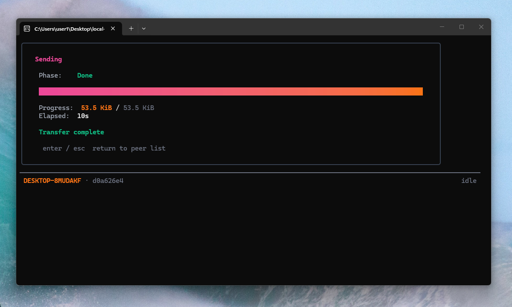
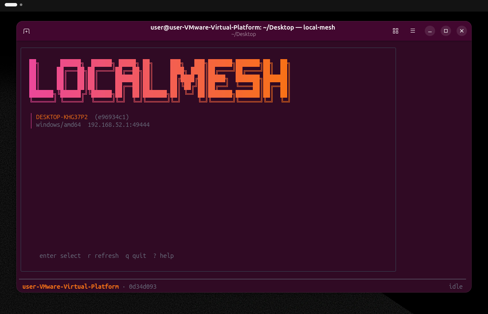
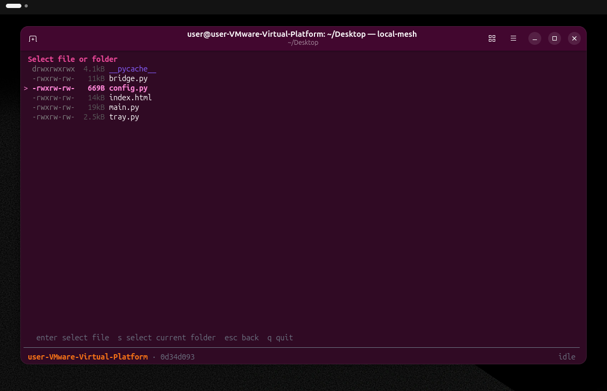

# local-mesh

local-mesh is a zero-configuration terminal UI for transferring files and folders across a local area network.

It relies on mDNS and a custom UDP fallback protocol for peer discovery. Transfers are routed over raw TCP. Data integrity is guaranteed via end-to-end SHA-256 verification before committing files to disk. The application operates entirely within your local network, requiring no accounts, cloud services, or external routing.

## Features

- **Automatic Peer Discovery:** Instantly discover LAN instances via mDNS (`_localmesh._tcp`) and UDP broadcast.
- **Terminal User Interface:** Fully interactive TUI built with [Bubbletea](https://github.com/charmbracelet/bubbletea).
- **Folder Streaming:** Directories are streamed as tar archives and extracted on the fly, avoiding intermediate disk writes.
- **Data Integrity:** SHA-256 hashes are computed and verified for all transfers.
- **Collision Protection:** Files are never overwritten; suffixes (e.g. `(1)`) are automatically appended to duplicate names.
- **Cross-Platform:** Native binaries for Windows, macOS, and Linux.

<p align="center">
  
  
</p>
<p align="center">
  
  
</p>

## Installation

### Option 1: Pre-compiled Binaries

Download the executable for your OS from the [GitHub Releases page](https://github.com/alanwnuczko/local-mesh/releases). To run the app from any terminal directory, you must add the folder containing the executable to your system's `PATH`.

**Windows:**
1. Extract the executable to a permanent folder (e.g. `C:\local-mesh`).
2. Open the Start menu, search for "Environment Variables", and press Enter.
3. Edit the **Path** variable under "User variables".
4. Add `C:\local-mesh` and click OK. Restart your terminal.

**macOS / Linux:**
Move the executable to `/usr/local/bin` using `sudo mv local-mesh /usr/local/bin/`.

<p align="center">
  
  
</p>

### Option 2: CLI Install (no GUI)

Use this if you have no browser available (e.g. WSL, a headless server, or SSH). These commands always install the latest release.

**Linux x86_64** (WSL, most servers)
```sh
curl -L https://github.com/alanwnuczko/local-mesh/releases/latest/download/local-mesh_Linux_x86_64.tar.gz | tar -xz
sudo mv local-mesh /usr/local/bin/
```

**Linux arm64** (Raspberry Pi, ARM servers)
```sh
curl -L https://github.com/alanwnuczko/local-mesh/releases/latest/download/local-mesh_Linux_arm64.tar.gz | tar -xz
sudo mv local-mesh /usr/local/bin/
```

**macOS Apple Silicon** (arm64)
```sh
curl -L https://github.com/alanwnuczko/local-mesh/releases/latest/download/local-mesh_Darwin_arm64.tar.gz | tar -xz
sudo mv local-mesh /usr/local/bin/
```

**macOS Intel** (x86_64)
```sh
curl -L https://github.com/alanwnuczko/local-mesh/releases/latest/download/local-mesh_Darwin_x86_64.tar.gz | tar -xz
sudo mv local-mesh /usr/local/bin/
```

After installation, verify it works by running `local-mesh` from any directory.

### Option 3: Install via Go

Go 1.22 or newer is required.

```sh
go install github.com/alanwnuczko/local-mesh/cmd/local-mesh@latest
```

Ensure your Go `bin` directory is in your `PATH`:
- **Windows:** `%USERPROFILE%\go\bin`
- **macOS / Linux:** `$HOME/go/bin`

### Option 4: Build from Source

Go 1.22 or newer is required.

```sh
git clone https://github.com/alanwnuczko/local-mesh.git
cd local-mesh
go build -o local-mesh ./cmd/local-mesh
```

Move the resulting binary to a location in your `PATH`.

## Usage

Start the application by running the binary in your terminal:

```sh
local-mesh
```

### Keybindings

| Key | Action |
|-----|--------|
| `↑` / `↓` / `j` / `k` | Navigate lists |
| `Enter` | Select peer / Confirm transfer |
| `r` | Refresh peer list |
| `s` | Select current directory for folder transfer |
| `Esc` | Return to previous screen |
| `y` / `a` | Accept incoming transfer offer |
| `N` / `d` / `Esc` | Reject incoming transfer offer |
| `c` | Cancel active transfer |
| `?` | Toggle help menu |
| `q` / `Ctrl+C` | Quit |

### Default Directories

- **Received Files:** 
  - Windows: `%USERPROFILE%\Downloads\local-mesh`
  - macOS / Linux: `~/Downloads/local-mesh`
- **Application Logs:** Written to `local-mesh.log` in the current working directory.
- **Device ID Configuration:** 
  - Windows: `%APPDATA%\local-mesh`
  - macOS: `~/Library/Application Support/local-mesh`
  - Linux: `~/.config/local-mesh`

## Network Requirements

local-mesh requires a shared Layer 2 network segment for multicast and broadcast packets to reach peers.

### Windows Environments
- **Firewall:** You must run the application as Administrator on the first launch to automatically configure the Windows Firewall for UDP ports 5353 and 53333.
- **Virtual Machines:** Virtual network adapters must support broadcast routing. Bridged and Host-Only modes are recommended. Standard NAT adapters may block discovery.

## Protocol Architecture

local-mesh utilizes a custom length-prefixed binary protocol over TCP:

```text
[FrameType: 1 byte] [Length: uint32 BE] [Payload: Length bytes]
```

- **Control Frames:** JSON encoded (`Offer`, `Decision`, `Complete`, `Ack`, `Error`).
- **Data Frames:** Raw file bytes streamed in chunks (default 64 KiB).
- **Folder Transfers:** Pre-processed to calculate the total size and SHA-256 hash before streaming via tar.

See `pkg/protocol/` for implementation details.

## License

MIT - see [LICENSE](LICENSE)
